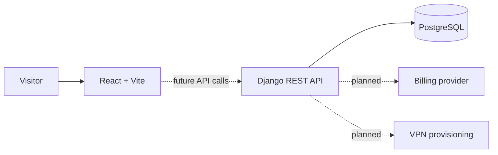

# 4seasons

**A full-stack VPN subscription concept that helps prospective customers compare plans and understand the product before account, billing, and provisioning systems are connected.**

[Live Demo](https://4seasons-one.vercel.app) · [Source](https://github.com/eerinessofsilence/4seasons)


> **Status:** interactive product prototype. The public experience is implemented; subscriptions, payments, authentication, and VPN provisioning are roadmap items.

## What it delivers

- Communicates the service proposition through a polished responsive landing page.
- Helps visitors compare subscription options and product benefits.
- Establishes reusable React components for future account and checkout flows.
- Provides a Django REST foundation for product data and upcoming integrations.
- Keeps local database credentials and Django settings environment-driven.

## Architecture



## Quick start

```bash
git clone https://github.com/eerinessofsilence/4seasons.git
cd 4seasons/frontend
npm install
npm run dev
```

Open the Vite URL printed in the terminal, normally `http://127.0.0.1:5173`; the public product prototype should load. Backend setup is documented through [`.env.example`](.env.example) and [`backend/requirements.txt`](backend/requirements.txt).

## Checks, security, and limits

```bash
cd frontend
npm run lint
npm run build
```

- Do not treat the UI as a working VPN service; it does not provision tunnels.
- Authentication, billing, subscription state, API integration, backend tests, and deployment hardening are not implemented yet.
- Never commit Django, database, or future payment-provider secrets.

## License

The repository is public for portfolio and evaluation purposes. No open-source license is currently included.
